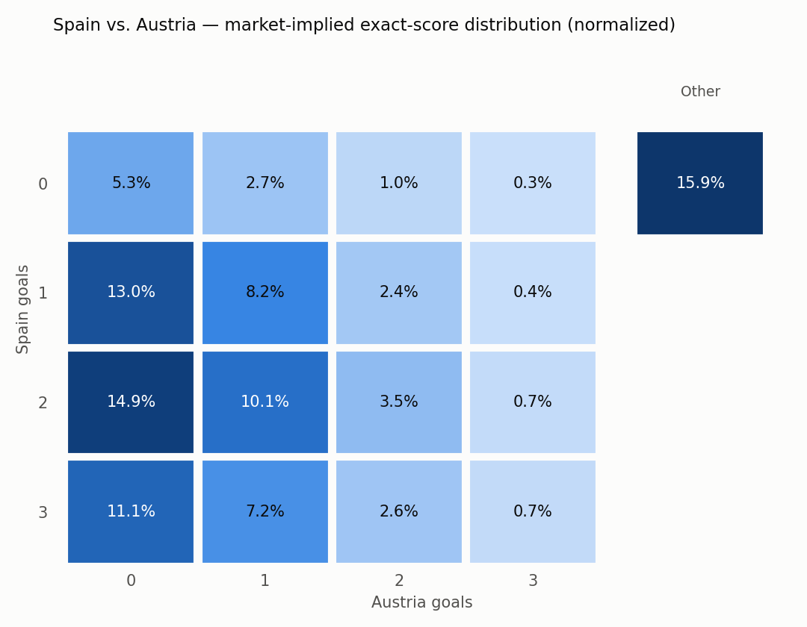
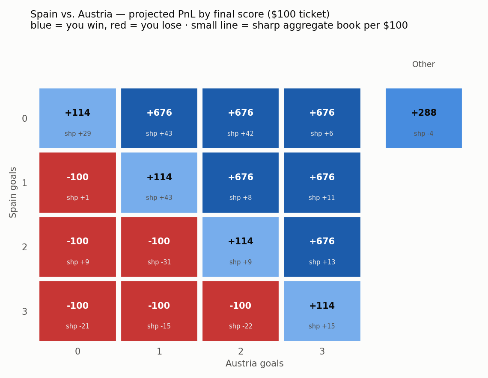

# claude-polymarket-skills

Two [Claude Code](https://claude.com/claude-code) skills for analyzing Polymarket soccer games. Read-only — no wallet, no keys, no order execution. Public APIs only (gamma, data-api, CLOB, lb-api).

| Skill | What it does |
|---|---|
| **poly-bet-plan** | Turns one game + a budget into a concrete trade ticket by **mirroring the top smart wallet**: crawls top holders, scores every wallet by all-time PnL, pulls each candidate's *entire* position in the game (market-maker/hedge books filtered out on the full book), then scales the best clean sharp's net book to your budget. |
| **poly-state-scan** | Arrow-Debreu consistency scanner: reads the exact-score grid as state prices and checks every bundle market (moneyline, totals, spreads, team totals, BTTS…) against its replication price. Also the shared library `poly-bet-plan` builds on. |

## Example output

`/poly-bet-plan spain vs austria` ends in a ticket like:

| 注 | 价 | 投入 | 份数 | 命中回款 |
|---|---|---|---|---|
| 🥇 No — Moneyline: Spain win | 25.8¢ | **$55** | 213.6 | **$213.59** |
| 🥈 Yes — Moneyline: Austria win | 8.0¢ | **$45** | 562.5 | **$562.50** |

…followed by the mirror target's full book with entry prices, per-leg order-book entry bands, an explicit self-rebuttal, and two charts:

<p>
  
  
</p>

## Install

Requires Python 3.10+ and `matplotlib` (charts). `certifi` is optional but recommended on macOS.

```bash
git clone https://github.com/Bruinworker/claude-polymarket-skills.git
cd claude-polymarket-skills
./install.sh          # copies both skills into ~/.claude/skills/
pip install matplotlib certifi
```

Restart Claude Code, then:

```
/poly-bet-plan spain vs austria
/poly-state-scan psg vs bayern
```

## Standalone CLI (no Claude needed)

The data pipelines are plain Python scripts — the skill layer only adds the agent's self-rebuttal and prose write-up on top.

```bash
python3 skills/poly-bet-plan/plan.py "spain austria" --budget 100 --out /tmp
python3 skills/poly-bet-plan/plan.py <game> --wallet 0xABC...   # force a mirror target
python3 skills/poly-state-scan/scan.py "spain austria" --out /tmp
```

## How poly-bet-plan decides

1. **discover** — top holders of the game's core markets form the candidate pool (discovery only, never evidence)
2. **score** — lb-api all-time PnL/volume per wallet → SHARP / win+ / FISH / MM tiers
3. **full book** — each ranked candidate's *entire* open position in the game is pulled from data-api `/positions` (every market incl. exact score, with average entry and running PnL); hedge/inventory books are detected here and excluded as mirror targets
4. **mirror** — the top clean sharp's net book, scaled to the budget ($-value weighted, min leg $10, rounded to $5, full budget deployed)
5. **execute** — CLOB entry band + slippage per leg, printed next to the target wallet's own average entry

The agent must then argue against the mirror (is the target really sharp? is the entry still there? can the budget fill?) before printing the ticket.

## Disclaimer

Research tooling, not financial advice. Prediction markets can lose your entire stake; smart wallets can be wrong, and mirroring them at a worse entry price can be negative-EV even when they are right. Check your jurisdiction's rules before trading.

## License

MIT
